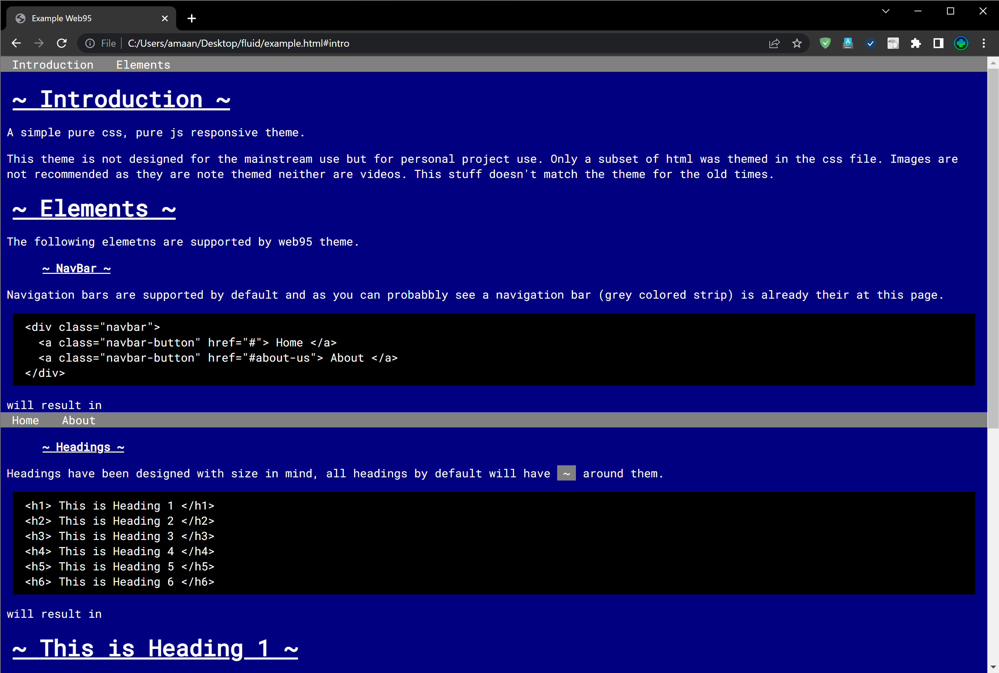
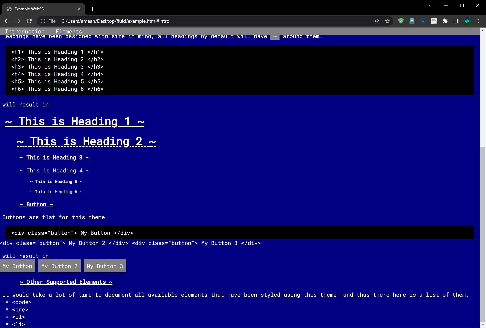

# Web95 (A ui framwork that makes your website look old)

The data is inside `web95` folder. Please copy it to your sites
static resources and from there link it inside your html in the following format

```html
<html>
  <head>
    ...
    <link rel="stylesheet" href="<static_folder>/web95/web95.css">
  </head>
  <body>
    ...
    <script src="<static_folder>/web95/web95.js"> </script>
  </body>
</html>
```

## Screenshots




## Licence

This repository is licensed under the [UNLICENSE](UNLICENSE)